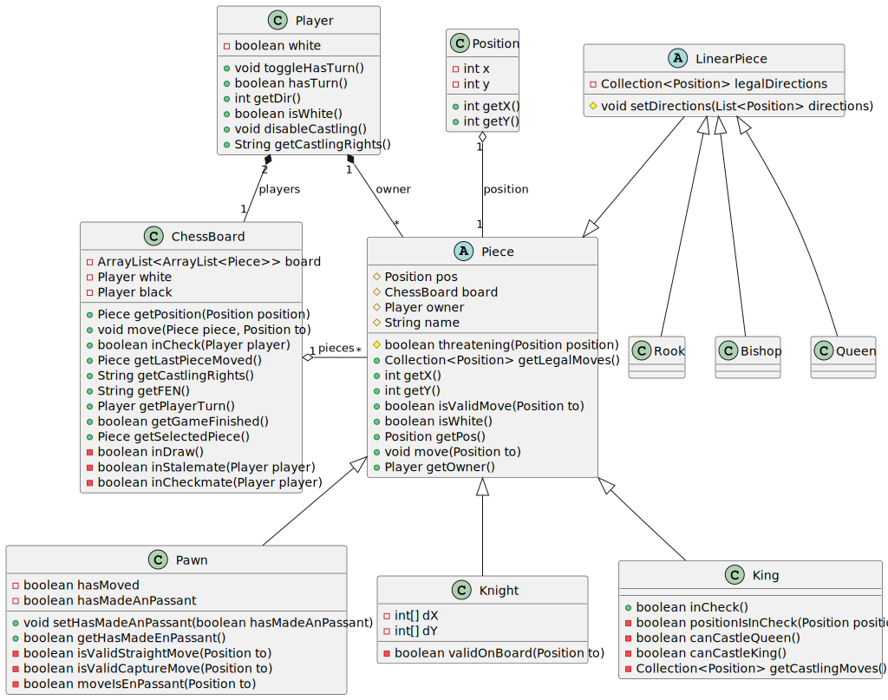

# Dokumentasjonsbeskrivelse

## Del 1: Beskrivelse av appen

I dette prosjektet har jeg lagd en sjakk-app. Den inneholder en startside hvor man har et par diverse valg. Man kan velge å spille vanlig sjakk, fischer random sjakk (tilfeldig plassering av ikke-bonde-brikkene, med noen ekstra regler), laste inn et spill fra en FEN-string enten direkte eller via en fil. Det er mulig underveis i et spill, eller etter fullført spill, å eksportere stillingen til en fil. På denne måten kan en fortsette et sjakkspill ved en senere anledning, eller for å teste ut hva en kunne gjort annerledes.

## Del 2: Diagram

### Klassediagram

Jeg har valgt å vise litt av hvordan chessboard-klassen, player, position og pieces henger sammen. For å gjøre det litt mer oversiktelig har jeg valgt å fjerne en del av de metodene og feltene som ikke er så relevante for å forstå hvordan klassene henger sammen.

### Del 3: Spørsmål

1. Hvilke deler av pensum i emnet dekkes i prosjektet, og på hvilken måte? (For
   eksempel bruk av arv, interface, delegering osv.)
   1. Svar: Dette prosjektet prøver å dekke mye av pensum i emnet. Jeg har blant annet brukt arv, interface, delegering, polymorfi, abstrakte klasser og innkapsling. Jeg har også implementert grensesnittet som Iterable, slik at jeg kan iterere over brettet. I tillegg benyttes det JUnit tester for å teste deler av koden, og jeg har brukt Javadoc til å dokumentere koden underveis.
1. Dersom deler av pensum ikke er dekket i prosjektet deres, hvordan kunne dere
   brukt disse delene av pensum i appen?
   1. Det er også enkelte konsepter jeg ikke har brukt i prosjektet. Et eksempel er ikke bruker observatør-observert-konseptet. Nå når jeg er ferdig, innser jeg at det ville mulig gjort koden min en god del ryddigere.
1. Hvordan forholder koden deres seg til Model-View-Controller-prinsippet? (Merk:
   det er ikke nødvendig at koden er helt perfekt i forhold til Model-View-Controller
   standarder. Det er mulig (og bra) å reflektere rundt svakheter i egen kode)
   1. Svar: Jeg har valgt å implementere dette prosjektet med tanke på å holde modellen og kontrolleren så adskilt som mulig der det har latt seg gjøre. Enkelte steder var det svært vanskelig å finne gode måter å implementere det på. Eksempelvis føltes det veldig naturlig at jeg viser et popup vindu for å velge hva en kan oppgradere en bonde til om den når enden av brettet i move metoden i ChessBoard-klassen. For å endre dette ville jeg måtte sende med en referanse til et vindu i ChessBoard-klassen, noe som føltes veldig feil. Dermed valgte jeg å lage et felt som lagret en mulig bonde som skal kunne bli promotert om den blir flyttet til enden av brettet, i move-metoden i ChessBoard. Deretter sjekket jeg om det feltet hadde noen verdi fra kontrolleren etter chessboard hadde flyttet en bonde, og da eventuelt viste jeg popup vinduet. Virker ikke optimalt, men det er sånn det ble. En svakhet jeg tror jeg ikke har luket helt bort er at jeg kanskje har for mye logikk i kontrollerene mine som ikke direkte kobler sammen modellen og brukergrensesnittet. Et eksempel på dette er at jeg i promotePawn metoden i ChessGameController har logikk for å lage ny brikke (dronning, springer, tårn og løper), i stedet for å ha det i modellen.
1. Hvordan har dere gått frem når dere skulle teste appen deres, og hvorfor har
   dere valgt de testene dere har? Har dere testet alle deler av koden? Hvis ikke,
   hvordan har dere prioritert hvilke deler som testes og ikke? (Her er tanken at
   dere skal reflektere rundt egen bruk av tester)
